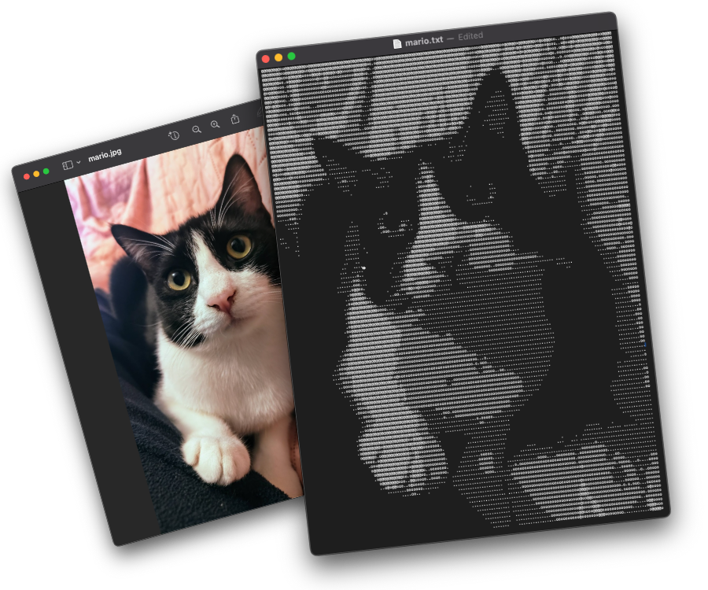
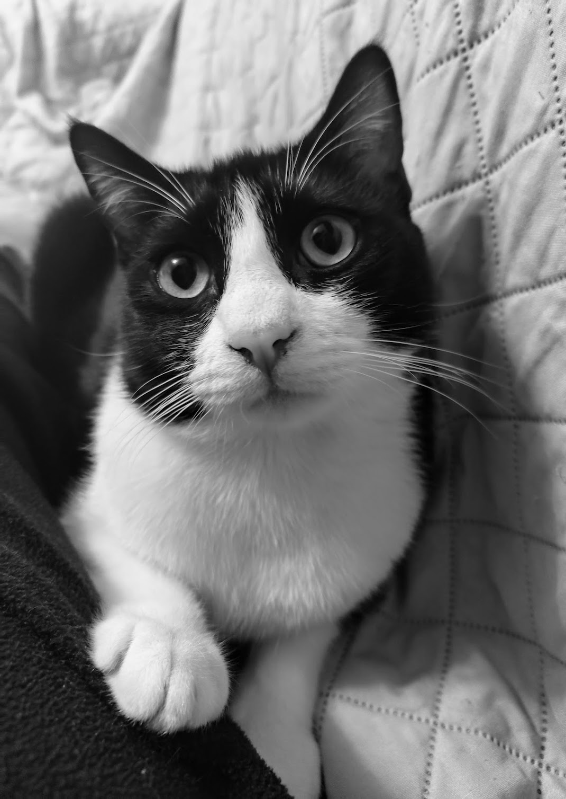

# img2ascii




Convert images into ASCII art.

User can provide additional options to specify the desired width in characters,
as well as the amount and type of horizontal correction to apply. (this is needed
because, unlike pixels which can be considered perfect squares, characters are more
tall than they are wide, meaning that directly mapping each pixel to a character will
result in a horizontally squeezed image).

## Build 

```
cargo build
```

## Usage 

Let's use our Mario as an example: 


Just type

```
cargo run -- -i imgs/mario.jpg 
```

Which gives us:

```
@@@o@@@o@@@@@@@@@@o@@@@@@@@@@@@@@@oo@@@o@@@@@@o@ooo@@@@@o@
@@@o@@oooo@oooo@@.o@@@@@@@@@@@@@@@oo@@@o@@@@@@ooooo@@@ooo@
@@o.o@oooooooo@@o.@@@@@@@@@@@@@@@@ooo. o@@@@@oooo@@@@oo@o@
@@o.o@ooooooo@@o.o@@@@@@@@@@@@@@@oo.    o@o@oooo@o@@oo@@oo
@@ooo@ooo@@o@@oo.o@@@@@@@@@@@@@@@@.  .. .o@@@@ooo@@@oo@@oo
@@@@oooo@@@@@oo..@@@@@@@@o@@@o@@@.  .... o@@@ooooo@oo@@ooo
@@@@@@o..oooooo.o@@@@o@@@o@@@@@o.   .... o@@ooooo@o.@@oooo
@@@@@oo     ..oo@@@@@@@@oooooo.      ..  o@oooooooooooo@@o
@@@@@@@o ..    .o@@ooo..       .         o@ooo.ooooooo@ooo
@o@@oooo.....           .    ...          oooo.oooooo@oooo
@@@@oo... ....   ...    oo.               ooo.ooo.oooooooo
@@@oo.           .     .o@o               .oo.o....ooooooo
oooo                   .@@@.       .       ..... ..ooooooo
 .o.                   .@@@o    . ..        ..    .ooooooo
  .         .   ..  .. o@@@@o.                    .ooooooo
.          ..    .... .@@@@@@oooooo.              ..oooooo
          ...        .@@@@@@oooo@@oo..            .ooooooo
          ...      ..@@ooooo...oooooo.            ..oooooo
         ....      .@@@o.... .oooooooo.....         .ooooo
         ..o.     .o@@@@o.. ......oooo.o...  ..     ...ooo
          .@o    ..oooooo..  .............           ..ooo
          o@@@..... ......................            ..oo
         .@@@@@@o.........................            ..oo
         .@@@@@@@ooooo....................            ..oo
         .@@@@@@@@ooooo....................           ...o
        .@@@@@@@@oooooooooo................           ...o
       .o@@@@@@@@oooooooooooo..............           ...o
      .oo@@@@@@@oooooooooooooo.o...........           ....
       .o@@@@@@@@oooooooo.ooooooooo.......            ....
        .o@@@@@@@oooooooooooooooooooo....            .....
         .o@@@@@@@ooooooooooooooooooo..             .....o
          .o@@@@@@@o...oooooooooooo..               ......
         .o@@@@@@@@oo..............                 ......
         o@@@@@@@@@@oo.    .......                    ....
         o@oo@@@@o@oooo    ......             ............
          .o@@@@@@@oooo.  ...oo..  ............oo.........
           .@@@@o@@oooo. ....oo....ooooooooooooooo........
            .oooo@o.... ..........oooooooooooooooo.oo....o
                ..       ....... ..ooooooooooooooo..oo..oo
                          .....o....ooooooooo@ooooo.ooo.oo
                            ..... ....oooooooooooooooooooo
                             .... .....oooooooo@ooooo..o@o
```

## More options 

The example above uses the default settings. To see all available options run 

```
cargo run -- -h
```

which will show all available configuration options: 

```
Convert an image file to ASCII art

Usage: img2ascii [OPTIONS] --input <INPUT>

Options:
  -i, --input <INPUT>    Image file to convert
  -w, --width <WIDTH>    Desired width of the ASCII art (in characters) [default: 80]
  -m, --mode <MODE>      Horizontal adjustment mode [default: stretch] [possible values: stretch, repeat]
  -a, --amount <AMOUNT>  Horizontal adjustment amount [default: 2]
  -v, --verbose          Display debug information
  -h, --help             Print help (see more with '--help')
  -V, --version          Print version
```

## How does it work? 

The basic idea is quite simple, although there are a couple of
gotchas. Let's take a look at it step-by-step.

### Converting the image to grey-scale

Let's start wit our initial image


and converti it to grey scale



so that each pixel can now be represented as a single "luminance" integer value 
(usually ranging from `0` to represent black to `255` for white)

### Mapping pixels to characters

The basic idea is to map each pixel in the image to a single ASCII 
character based on the pixel's brightness (or luminance). 
For example, a very dark pixel could be  mapped to 
something like `@` while a bright one could be mapped to something like `.` (or even
an empty space).

This is a good starting point for a mapping function:

```rust
/// Convert a luminance value to a character
fn lumi_8_to_char(lumi: u8) -> char {
    match lumi {
        0..=63 => ' ',
        64..=127 => '.',
        128..=191 => 'o',
        192..=255 => '@',
    }
}
```

(it's super simple but in fact already provides acceptable results)

But we're not done yet, as there'a little problem: 
our image has a size of 1070  ×  1508 pixels, meaning 
that our ASCII art will be 1070 characters wide and 1508 
characters tall - definutely too big to fit on the screen!! 

### Scaling the input image

To have something that fits nicely on the screen we 
want our output to be much smaller; something around 100 characters wide can is a good starting point (the exact number depends on the size of the screen, but this gives an idea).

One way to achieve that is to simply resize the grey-scale image prior
to apply the pixel-to-ASCII mapping. 

In our example, we could for example resize our image so that it is 80 pixels wide, so that when mapping pixels to ASCII characters, 
the result will be 80 charactwers wide, as wanted. 


The proportions are not quite right on this page, but you get the idea; if we zoom in on this tiny image, we can now see each individual pixel:


and we can now imagine filling each "square" with an ASCII
character, giving us a final result of the correct size this time. 

```
@@@@@@o@@@@@@@@o@@@@@@@@@@@@@@o@@@@@@@@o@ooo@@@@o@
@@@o@@o@@@@@@@@o@@@@@@@@@@@@@@o@@@@@@@@@oooo@@@@o@
@@oo@ooo@oooo@o.@@@@@@@@@@@@@oo@@o@@@@@@oooo@@@oo@
@@oo@oooooooo@oo@@@@@@@@@@@@@oo@oo@@@@@oo.o@@@ooo@
@@oo@ooooooo@@.o@@@@@@@@@@@@@ooo  o@@@@ooo@@@@o@o@
@@oo@ooooooo@o.o@@@@@@@@@@@@@@o   .@o@oooo@o@oo@oo
@@oo@oooooo@oo.o@@@@@@@@@@@@@o     oooo@ooo@@o@@oo
@@oo@ooo@oo@oo.@@@@@@@@@@@@@@o  .. o@@@ooo@@oo@@oo
@@@oooo@@@@oo.o@@@@@@@@@@@@@@  ... o@@@oooo@oo@@oo
o@@@oo@@@@@oo.o@@@@@@@o@@o@@o   .. .@@@oooo@oo@ooo
@@@@@@oo@@ooo.o@@@o@@@o@@o@o.  ... .@@ooooooo@@ooo
@@@ooo  ..oooo@@@@o@@oo@@@@.   ... .@@oo@oooo@oooo
@@@@oo.   .ooo@@@@o@@oo@oo.     .  .@oo@ooooooo@@o
@@@@@@.     .@@@@@o@o...         . .@ooo.ooooo@@oo
@@@@@@o .    .o@ooo      ...       .@oooooooo@oooo
@o@@@oo....              ...        oooo...ooo@ooo
@o@oooo.....        .o.             o@o..ooooooooo
@@@@o..  ...   ..   .oo             .ooooo..oooooo
@@@o.    ..    .    .oo             ooo.o..ooooooo
oooo                .o@             .o.o. ..oooooo
ooo.                o@@.      .      .... ..oooooo
.oo.                o@@o      .       ...  .oooooo
 .o                 o@@o   ....       ...  .oooooo
  .           .     o@@@.                  .oooooo
          .   .  .. @@@@o.                 .ooo.oo
.        ..   ...o .@@@@@oo..o.            ..oooo@
         ..        o@@@@@o@@@@o.           .oooooo
         ..       .@@@@@@ooo@oo..          .oooooo
         ..       o@@@@oo.oooooo.          ..ooooo
          .     ..@@oooo. .ooooo.           .ooooo
        . .     .o@@o... .ooooooo..         ..oooo
        ...     .o@@@.   .oooooooooo.        .o.oo
        ..o    ..@@@oo. .....ooo.....  ..    ...oo
         oo     o@o@oo.. ............        ..ooo
        .@@.   ..oooo... ...........          ..oo
        .@@o. ... oo................          ..oo
        o@@@oo.   ..................           ..o
        o@@@@@o.ooo.................          ..oo
        o@@@@@ooooo.................          ..oo
        o@@@@@@ooo..................          ...o
        o@@@@@@@oooo.................         ....
       .@@@@@@@oooooooo..............         ...o
       o@@@@@@@oooooooo..............         ...o
      .o@@@@@@@ooooooooo.............         ...o
      o@@@@@@@@ooooooooooo...........         ...o
     .oo@@@@@@ooooooooooooo..........         ....
      .o@@@@@@oooooooooooooo........           ...
      .o@@@@@@ooooooo.ooooooooo.....           ...
       .@@@@@@@oooooo.oooooooooo....          ....
       .o@@@@@oooooooooooooooooo...           ....
        oo@@@@@ooooooooooooooooo..          ......
        .o@@@@@@o..ooooooooooo...            .....
         oo@@@@@@...oooooooooo..             .....
         o@@@@@@@o.....ooooo...              .....
        .@@@@@@@@o............               .....
        o@@@@@@@@o.    .......                ....
        o@@@@@@@@oo.    .....            .     ...
        @@o@@@@o@oo.   ......           ..........
        .oo@@@@ooooo   ......   .     ............
         .@@@@@@@ooo  ...oo.  ..........oo........
         .@@@@o@oooo  ...oo. ....o..oo.oooo.......
          o@@oo@o.o. ....oo..oooooooooooooo.o....o
           oo.ooo..  ........ooooooooooooooooo...o
             .oo..   .........ooooooooooooo..o..oo
                      ....o...ooooooooooooo..oo.oo
                      ....o....oooooooo@oooo.oo.oo
                       .........ooooooo@oooooooooo
                        .... ....ooooooooooooooooo
                         ... ....ooooooo@ooooo..oo
                          ..  ....oooooo@oooo...oo
```
Cool! But there's another problem...

The resulting ASCII art seems to be horizontally "squeezed" compared to the input image...But why? 

Well, the problem is that we can think of pixels as squares (see above), 
but that definitely isn't true for characters! 
Characters, in fact, tend to be taller then they are wide; to "make a square"
you usually need at least 2 characters, or maybe 3 (much depends on the screen type, and the font itself I guess).

### Correcting the aspect ratio

So, once understood, there are a few ways to fix this issue. 

#### Repeating charcaters

A simple method is to  simply repeat each character 'n' times (horizontally) when generating
the ASCII art (with n usually 2 or 3).

We can do this by running 

```
cargo run -- -i imgs/mario.jpg -m repeat -a 2
```

which tells the program to use the "repeat" correction method 
with an amount of 2 (in this case meaning "repeat each character 
2 times horizontally).

This is the result


```
@@@@@@@@@@@@@@oo@@@@@@@@@@@@@@@@@@@@@@@@oooo@@@@@@
@@oooooooooo@@oo@@@@@@@@@@@@@@@@oo@@@@@@oooo@@oooo
@@oooooooooooooo@@@@@@@@@@@@@@..  oo@@oooo@@@@oo@@
@@oooooooo@@oooo@@@@@@@@@@@@oo    ..@@oooo@@oo@@oo
@@@@oo@@@@@@..oo@@@@@@@@@@@@..  ....@@oooooooo@@oo
@@@@oo..oooooo@@@@@@@@@@@@oo  ......@@oooooooooooo
@@@@oo      oo@@@@@@oo....        ..@@oooooooooooo
@@@@@@oo..    ......      ..        oooooooooooooo
@@@@oo......        ....            oooooooooooooo
@@oo..        ..    oo..            oooo....oooooo
oo..                @@oo              ..  ..oooooo
....                oo@@                  ..oooooo
          ..  ......@@@@oo....            ..oooooo
        ....      oo@@@@@@@@@@..          ..oooooo
          ..    ..@@@@oo..oooooo..          oooooo
        ....    oo@@oo....oooooo....        ..oooo
        ....    oo@@oo........oo....          ..oo
        oooo  ....oo................          ..oo
        oo@@oo......................          ..oo
        @@@@@@oooo..................          ..oo
        @@@@@@@@oooo................          ....
      ..@@@@@@oooooooooo..............        ....
      oo@@@@@@oooooooooooo..........          ....
      oo@@@@@@oooooooooooooo........          ....
      ..@@@@@@oooooooooooooooooo....          ....
        oo@@@@@@oooooooooooooooo..          ......
        ..@@@@@@oo..oooooooooo..            ......
        oo@@@@@@oo............                ....
        @@@@@@@@@@oo    ......          ....  ....
        ..@@@@@@oooo  ..oo..    ..................
          @@@@oooooo....oo....oooooooooooooo......
          ....oo..    ........oooooooooooooooo..oo
                      ..oo....oooooooooooooooooooo
                        ........oooooooooooooooooo
                          ..  ....oooooooooooo..oo
```
#### Stretching the input image prior to mapping

A second method we could use instead is to continue 
mapping pixels to characters 1:1 (i.e. each pixel is represented by a single character) but in order to
fix the aspect ratio we stretch the input image horizontally by a factor of 2 or 3 to compensate for the
horizontal squeezing effect. 

```
cargo run -- -i imgs/mario.jpg -m stretch -a 2
```

```
@@@@@@o@@@@@@@@o@@@@@@@@@@@@@@o@@@o@@@@@oooo@@@@o@
@@oo@ooo@oooo@o.@@@@@@@@@@@@@oo@@o@@@@@ooooo@@ooo@
@@oo@ooooooo@o.o@@@@@@@@@@@@@@o.  o@o@oooo@@@oo@o@
@@oo@oooooo@oo.@@@@@@@@@@@@@@o     oo@o@ooo@@o@@oo
@@@@ooo@@@@oo.o@@@@@@@o@@o@@o  ... .@@@oooo@oo@@oo
@@@@oo..ooooooo@@@o@@@o@@@@o   ... .@@ooooooo@oooo
@@@@@@.    ..o@@@@o@o.oo...     .  .@oo@ooooooo@@o
@@@@@@o...   ......       ..       .@ooo.ooooo@ooo
@@@@ooo. ...        .o.             ooo.oooooooooo
@@@o.     .    .    .oo             .oo.o...oooooo
ooo.                o@@.      .      ....  .oooooo
 ..                 o@@o.                  .oooooo
          .   .. .. @@@@@o....             .oooooo
         ..       .o@@@@@oo@@@o.           .oooooo
         ..      .@@oooo...ooooo.          ..ooooo
        ...     .o@@o... .ooooooo....       ..oooo
         oo     o@@@oo. ......o......        ...oo
        .@@o  ....oo.... ...........          ..oo
        o@@@@o......................           ..o
        o@@@@@@oooo.................          ...o
        o@@@@@@@oooo.................         ...o
      .o@@@@@@@ooooooooo.............         ...o
     .o@@@@@@@oooooooooooo...........         ...o
      .o@@@@@@oooooooooooooo........           ...
       .o@@@@@@ooooooooooooooooo...           ....
        .o@@@@@@oooooooooooooooo..          ......
         o@@@@@@@o..o.ooooooo..              .....
        o@@@@@@@@o. ..........                ....
        @@o@@@@o@oo.   ......           ... . ....
         o@@@@@@oooo  ...o..   .... ..............
          o@@@o@oooo ....oo...ooooooooooooo.......
           ...oo...  ........oooooooooooooo.oo...o
                      .........ooooooooooooo.oo.oo
                        ........ooooooo@oooooooooo
                         ... .....oooooo@ooooo..oo
```

Notice that there are default values for this parameters, so running something like

```
cargo run -- -i imgs/mario.jpg
```

is usually enough.


## Details

### The mapping function 

How do we actually map the pixels to ASCII characters? 

A conventional approach would  be to iterate through each individual pixel using 
nested for loops (one for rows and onw for columns). 

However for this exercise I wanted to write this in a more functional way, using the 
functional programming facilities of Rust (closures, iteratores etc.).

This is what the mapping function looks like. 

We essentially trasform each row in the image into an ASCII string (with an appended newline), finally concatenate all those strings together to give our final string. 

The way we map each image row into a string is by simply mapping the 
`lumi_8_to_char` (shown above) to each pixel. 

```rust
/// Convert a grey-scale image to ASCII art by mapping each pixel (consisting of
/// a single luminance value) to a character.
fn img_to_ascii(img: &image::GrayImage, config: &Config) -> String {
    img.rows()
        // map each row to a string of ASCII characters (terminating with a newline)
        .flat_map(|row| {
            row.flat_map(|lumi| lumi_8_to_char(lumi.0[0]))
                .chain(std::iter::once('\n'))
        })
        // collect all the rows into a single string
        .collect::<String>()
}
```