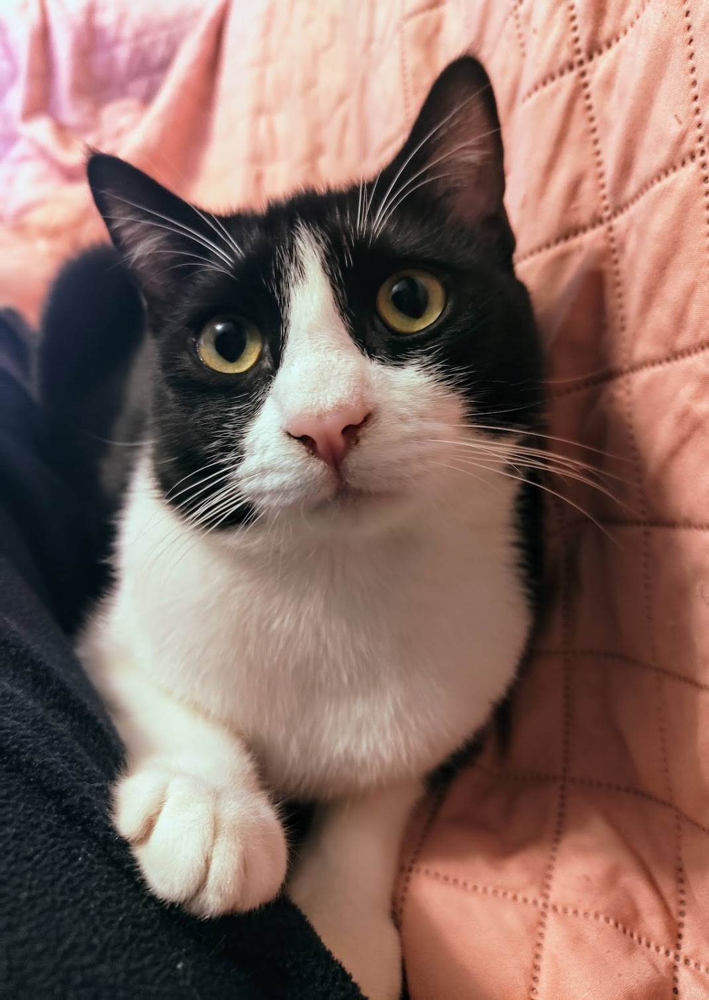

# img2ascii

## Basic usage 




```
cargo run -- -i imgs/mario.jpg 
```

Which gives us the output:

```
@@@@@@@@@@o@@@@@@@@@@@@@@o@@@@@@@@@@@@@@@@@@@@@ooo@@@@o@@@@@@@@@o@o.o@o@@@@@@o@@
@@@@oo@@@ooo@@@@o@ooo@@o.o@@@@@@@@@@@@@@@@@@@@@ooo@@@@o@@@@@@@@@ooooooo@@@@@@o@@
@@@@oo@@oooooo@ooooo@@@o.@@@@@@@@@@@@@@@@@@@@@@ooo@@ooo@@@@@@@@ooo..oo@@@@oo@oo@
@@@oo.@@oooooooooooo@@o..@@@@@@@@@@@@@@@@@@@@@@oo@o.  .@@@@@@@ooooo@@@@@@ooo@oo@
@@@oo.o@ooooooooooo@@oo.o@@@@@@@@@@@@@@@@@@@@@ooo.     o@oo@ooooooo@oo@@ooo@@oo@
@@@oooo@oooooooooo@@oo..o@@@@@@@@@@@@@@@@@@@@@@o    ..  ooo@o@@@ooooo@@@oo@@@@oo
@@@oooo@@ooo@@@@@@oooo.o@@@@@@@@@@@@@@@@@@@@@@o    ...  .o@@@@@ooooo@@@ooo@@@oo@
oo@@@@oooo@@@@@@@@ooo..o@@@@@@@@@@@o@@o@oo@@@o    ..... .@@@@@o.oooo@@ooo@@@oooo
@@@@@@@@@o..oo@@ooooo.o@@@@@@@@@@@ooo@o@oo@@o     .....  o@@@ooooooo@@oo@@@ooooo
@@@@@@ooo.     ..oooooo@@@@@oo@@@@oo@@@@ooo.      ....   o@@@oo@oooo@o.o@oooo@oo
@@@@@@@@@@.       ..oo@@@@@@@o@@oo..o.....          .    o@@oo@o.oooooooooo@@@oo
@@@@@@@@@@o ...      .oo@ooooo..           .             @@ooo@o.oooo.oo@o@@oooo
@oo@@@oooooo......                .     ....             .@oooo...ooooooo@@ooooo
@@@@@oooooo.. .....      ..      .o..                     ooooo..oooooooo@oooooo
@@@@@@o..     ....      ...     ..o@.                     ooooo.oo....oooooooooo
oooooo.                         .oo@o                     .ooo.oo.. ..oooooooooo
ooooo.                          .@@@@.           .          ......  ..ooo.oooooo
...o.                           o@@@@o.    ..   ..          ......  ..oooooooooo
  ...                   .       o@@@@oo.     ...              .     ...ooooooooo
.  .            ..    .o    o.  o@@@@@@o.                            ..oooo.oooo
..             ...     ....o.  .@@@@@@@@@ooo..oo.                    ...ooooooo@
   .          ....            .@@@@@@@@@oo@@@@@@o..                  ..ooooooooo
              ....           o@@@@@@@@ooooooooooooo..               ...ooooooooo
              . ..        ..o@@@oooooo.....ooooooooo.                 ..oooooooo
             .....        .o@@@@o......  .oooooooooo......             ..ooooooo
             ...o.       ..o@@@@@o...  ....oooooooooooooo.... ..        ..o.oooo
            ...o@.       .o@@o@@oooo.  ..........o.........     .        ...oooo
              o@@o.     ..oooooooo....  ..................                ..oooo
             .o@@@@.......  ..oo..........................                 ..ooo
             o@@@@@@ooo..  ...............................                 ...oo
             o@@@@@@@@@ooooooo............................                ...ooo
            .o@@@@@@@@@@ooooo.............................                ....oo
             o@@@@@@@@@@@oooooo............................               .....o
            o@@@@@@@@@@@ooooooooooooo......................               .....o
          .o@@@@@@@@@@@oooooooooooooooo.....................              .....o
         .oo@@@@@@@@@@@oooooooooooooooooo..................               .....o
        ..oo@@@@@@@@@@@ooooooooooooooooooo.o...............               .....o
         ..oo@@@@@@@@@ooooooooooooooooooo.ooo.............                 .....
          ..o@@@@@@@@@@@oooooooooo.ooooooooooooooo.......                .......
            .oo@@@@@@@@@ooooooooooooooooooooooooooo.....                 ......o
            ..o@@@@@@@@@ooooooooooooooooooooooooooo....                ........o
             .ooo@@@@@@@@@o....ooooooooooooooooo....                   ........o
              .o@@@@@@@@@@@o.....o.ooooooooooo....                      ........
             .o@@@@@@@@@@@@oo...................                        ........
            .o@@@@@@@@@@@@@ooo.      ..........                           ......
            .@@@@o@@@@@@o@@oooo.      ........                  ........ .......
             o@oo@@@@@@@o@oooooo     .........               . .................
               o@@@@@@@o@@oooooo.   ....ooo..   ................ooo.............
               .@@@@@@oo@@oooooo. ......ooo.. .....oooo..oooo.ooooooo...........
                .@@@@o.o@oo.ooo. .......oo.....ooooooooooooooooooooo..ooo.....oo
                  .....oo.....   ........... ..ooooooooooooooooooooooo..oo....oo
                                   ......... ...ooooooooooooooooooooo...ooo..ooo
                                    .......o......oooooooooooo@ooooooo..ooo..ooo
                                     ..o...........ooooooooooo@ooooooooooooooooo
                                       ...... .......oooooooo@oo@@ooooooooo.oooo
                                         ....  ........oooooo@ooo@ooooooo....@oo

```

## More options 

### Setting the desired ASCII art width (in characters) 

If not provided, we'll use a default value. 

```
cargo run -- -i imgs/mario.jpg -w 50
```

```
@@@@@@o@@@@@@@@o@@@@@@@@@@@@@@o@@@o@@@@@oooo@@@@o@
@@oo@ooo@oooo@o.@@@@@@@@@@@@@oo@@o@@@@@ooooo@@ooo@
@@oo@ooooooo@o.o@@@@@@@@@@@@@@o.  o@o@oooo@@@oo@o@
@@oo@oooooo@oo.@@@@@@@@@@@@@@o     oo@o@ooo@@o@@oo
@@@@ooo@@@@oo.o@@@@@@@o@@o@@o  ... .@@@oooo@oo@@oo
@@@@oo..ooooooo@@@o@@@o@@@@o   ... .@@ooooooo@oooo
@@@@@@.    ..o@@@@o@o.oo...     .  .@oo@ooooooo@@o
@@@@@@o...   ......       ..       .@ooo.ooooo@ooo
@@@@ooo. ...        .o.             ooo.oooooooooo
@@@o.     .    .    .oo             .oo.o...oooooo
ooo.                o@@.      .      ....  .oooooo
 ..                 o@@o.                  .oooooo
          .   .. .. @@@@@o....             .oooooo
         ..       .o@@@@@oo@@@o.           .oooooo
         ..      .@@oooo...ooooo.          ..ooooo
        ...     .o@@o... .ooooooo....       ..oooo
         oo     o@@@oo. ......o......        ...oo
        .@@o  ....oo.... ...........          ..oo
        o@@@@o......................           ..o
        o@@@@@@oooo.................          ...o
        o@@@@@@@oooo.................         ...o
      .o@@@@@@@ooooooooo.............         ...o
     .o@@@@@@@oooooooooooo...........         ...o
      .o@@@@@@oooooooooooooo........           ...
       .o@@@@@@ooooooooooooooooo...           ....
        .o@@@@@@oooooooooooooooo..          ......
         o@@@@@@@o..o.ooooooo..              .....
        o@@@@@@@@o. ..........                ....
        @@o@@@@o@oo.   ......           ... . ....
         o@@@@@@oooo  ...o..   .... ..............
          o@@@o@oooo ....oo...ooooooooooooo.......
           ...oo...  ........oooooooooooooo.oo...o
                      .........ooooooooooooo.oo.oo
                        ........ooooooo@oooooooooo
                         ... .....oooooo@ooooo..oo
```

### Setting the horizontal squeeze factor 

This defaults to 2 and should work fine most of the times.


```
cargo run -- -i imgs/mario.jpg -w 40 -s 1
```

```
@@@@@@@@@@@@o@@@@@@@@@@@o@@@@@@@@oo@@@o@
@@o@oo@@@o@@o@@@@@@@@@@@o@@o@@@@ooo@@@o@
@@o@oooooo@oo@@@@@@@@@@oo@oo@@@@o.o@@oo@
@@o@oooooo@.o@@@@@@@@@@@o. o@@@ooo@@@o@@
@oooooooo@o.o@@@@@@@@@@@.  .@@ooooo@o@@o
@o.oooooo@o.@@@@@@@@@@@o    oo@@oo@@o@@o
@ooooo@@@ooo@@@@@@@@@@@. .. o@@ooo@oo@@o
o@@oo@@@@o.o@@@@@@@@o@o  .. o@@ooo@oo@oo
@@@@@.o@oo.o@@@@@oo@o@.  .. .@oooo@o@ooo
@@@oo  ..oo@@@o@@o@@o.   .. .@oooooooooo
@@@@o.   .o@@@o@o.o..     . .@oooooooo@o
@@@@@. .  .o@oo.     .    . .@oooooo@@oo
oo@ooo...           ..       ooo.ooooooo
@@@ooo...   ..  .o           oo.oooooooo
@@@o.  ..   .   .o.          oooo..ooooo
o@o.            .@.          oo.. .ooooo
oo.             o@o     .     ... .ooooo
.o.             o@o     .     ... .ooooo
 ..             o@@.   .          .ooooo
        .  .  . @@@o.             .ooooo
.       .  .....@@@@oo.o.          .oooo
       ..      o@@@@o@@@o.        .ooooo
       ..     .@@@@ooooooo        .ooooo
        .    .o@ooo..ooooo.        .oooo
       ..    .@@o.. .ooooo...      ..ooo
       ..    .@@o.  .ooooooo.. .    ..oo
       oo    o@@oo. ....o....   .   ..oo
       o@   .oooo.. .........        .oo
       @@o... .o.............        ..o
      .@@@o..................         .o
      .@@@@oooo..............        ..o
      .@@@@@oo...............        ..o
      .@@@@@@ooo.............        ...
      o@@@@@oooooo............       ..o
     .@@@@@@ooooooo...........       ..o
     o@@@@@@oooooooo..........       ...
    .o@@@@@oooooooooo........        ...
     o@@@@@oooooooooooo......         ..
     .o@@@@@ooooo.ooooooo....        ...
      .@@@@@oooooooooooooo..        ....
      .o@@@@ooooooooooooo..         ....
       o@@@@@o.ooooooooo..          ....
       o@@@@@o....ooooo..           ....
      .@@@@@@o..........            ....
      o@@@@@@@o.  ......             ...
      o@o@@@@@o.   ....         ........
      .oo@@@oooo  .....        .........
       .@@@@@ooo  ..o.. ........oo......
        @@@o@ooo ...o.....ooooooooo.....
        o@oo@oo. ...o..ooooooooooo.o...o
         ..oo..  .......ooooooooooo.o..o
                 .......ooooooooooo.o..o
                  ...o...oooooo@ooo.oooo
                   ..o....ooooo@oooooooo
                    ......oooooo@oooo.oo
                    ..  ...ooooo@ooo..oo
```

or also 

```
cargo run -- -i imgs/mario.jpg -w 60 -s 3
```

```
@@@o@@@o@@@@@@@@@@o@@@@@@@@@@@@@@@@oo@@@@@@@@@@@oo.oo@@@@oo@
@@@oo@ooooooooo@@o.@@@@@@@@@@@@@@@@oooo..@@@@@@ooooo@@@oo@o@
@@o.o@oooooooo@oo.o@@@@@@@@@@@@@@@@o.    .@o@ooooo@o@@oo@@oo
@@@@oooo@@@@@@oo.o@@@@@@@@o@@@@@@@o   ... .@@@@oooo@@oo@@ooo
@@@@@oo....oooooo@@@@@@@@@o@@@ooo.   .... .@@oooooo@oo@ooooo
@@@@@@@o      ..o@@@oooo........          .@oooo.ooooooo@ooo
@@@@@oooo.....    ..     ..                .ooo..oooooo@oooo
@@@@o..    ...    .     .o@.               .ooo.o...oooooooo
.oo.                    o@@@.       .        ....  ..ooooooo
  ..        .    ..  .  o@@@@o                     ..ooooooo
           ...      ...o@@@@@@oooooo..              .ooooooo
           ..        .@@@oooo...ooooooo.            ..oooooo
          ....     .o@@@o...  ..ooooooo.....         ..ooooo
          .o@.    ..oooooo.. ...............           ..ooo
          o@@@oo...........................             ..oo
         .@@@@@@@ooooo......................           ...oo
         .@@@@@@@@@oooooo.o.................            ...o
       .o@@@@@@@@oooooooooooo................          ....o
      ..o@@@@@@@@oooooooooooooo.o...........            ....
        .o@@@@@@@@oooooooooooooooooooo....             .....
          .o@@@@@@@oo.ooooooooooooooo...             ......o
          .o@@@@@@@@o.........ooo....                 ......
         .@@@@@@@@@@ooo.    .......               .    .....
          .oo@@@@@@@oooo   .......   ..... .................
            o@@@oo@oooo. .....oo....oooooooooooooooo........
                 ...      ....... ..oooooooooooooooo..oo..oo
                            ....o.....oooooooo@ooooooooooooo
```


